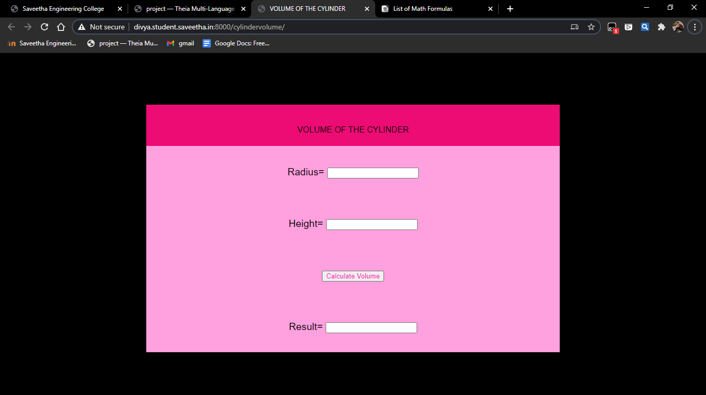
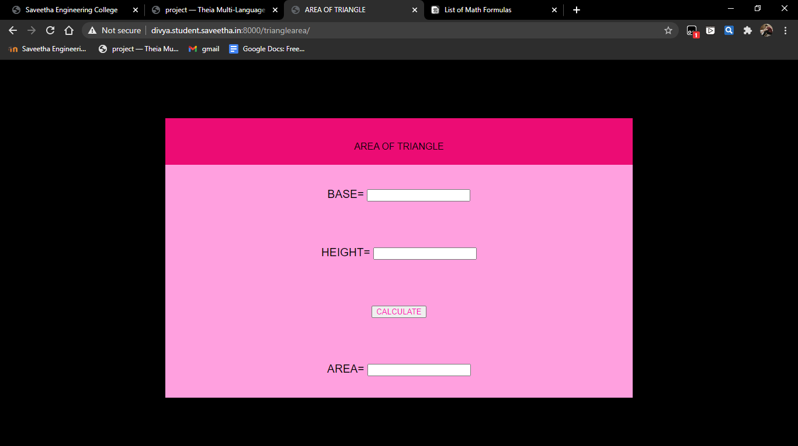

# Mathematical Calculations using JavaScript
## AIM:
To design a website to calculate the volume of a cylinder and area of triangle using JavaScript.

## DESIGN STEPS:
### Step 1: 
Requirement collection.
### Step 2:
Creating the layout using HTML and CSS.
### Step 3:
Write JavaScript to perform calculations.
### Step 4:
Choose the appropriate style and color scheme.
### Step 5:
Validate the layout in various browsers.
### Step 6:
Validate the HTML code.
### Step 6:
Publish the website in the given URL.


### PROGRAM:

### cylindervolume.html 
```

<!DOCTYPE html>
<html>

<head>
    <title>VOLUME OF THE CYLINDER</title>
    <link rel="stylesheet" href="">
</head>

<body>
    <div class="container">
        <div class="formview">
            <div class="banner">
                VOLUME OF THE CYLINDER
            </div>
            <div class="content">
                <form action="/cylindervolume/" method="POST">
                    
                    <div class="forminput">
                        <label for="value_a">Radius=</label>
                        <input type="text" name="value_a" id="value_a" value ="{{a}}">
                    </div>
                    <div  class="forminput">
                        <label for="value_b">Height=</label>
                        <input type="text" name="value_b" id="value_b" value ="{{b}}">
                    </div>                    
                    <div class="forminput">
                        <button type="button" name="button_add" id="button_add">Calculate Volume</button>
                    </div>
                    <div  class="forminput">
                        <label for="value_c">Result=</label>
                        <input type="text" name="value_c" id="value_c" readonly>
                    </div>
                </form>
            </div>
        </div>
    </div>
    <script src="/static/js/mathscript.js"></script>
</body>

</html>

```
## trianglearea.html
```

<!DOCTYPE html>
<html>

<head>
    <title>AREA OF TRIANGLE</title>
    <link rel="stylesheet" href="">
</head>

<body>
    <div class="container">
        <div class="formview">
            <div class="banner">
                AREA OF TRIANGLE
            </div>
            <div class="content">
                <form action="" method="GET">
                    
                    <div class="forminput">
                        <label for="value_d">BASE=</label>
                        <input type="text" name="value_d" id="value_d">
                    </div>
                    <div  class="forminput">
                        <label for="value_e">HEIGHT=</label>
                        <input type="text" name="value_e" id="value_e">
                    </div>                    
                    <div class="forminput">
                        <button type="button" name="button_area" id="button_area">CALCULATE</button>
                    </div>
                    <div  class="forminput">
                        <label for="value_f">AREA=</label>
                        <input type="text" name="value_f" id="value_f" readonly>
                    </div>                   
                </form>
            </div>
        </div>
    </div>
    <script src="/static/js/triangle.js"></script>
</body>

</html>
```


## JAVASCRIPT:

 ```
 result_button = document.querySelector('#button_add');

result_button.addEventListener('click', function(e){
    txta = document.querySelector('#value_a');
    txtb = document.querySelector('#value_b');
    txtc = document.querySelector('#value_c');
    
    let c;

    c = 22/7 * parseFloat(txta.value**2) * parseFloat(txtb.value);

    txtc.value = c;

});

```
```
result_button = document.querySelector('#button_area');

result_button.addEventListener('click', function(e){
    txtd = document.querySelector('#value_d');
    txte = document.querySelector('#value_e');
    txtf = document.querySelector('#value_f');
    
    let f;

    f =  parseFloat(txtd.value)/2 * parseFloat(txte.value);

    txtf.value = f;

})
```

## OUTPUT:





## RESULT:

Thus a website is designed for Mathematical Operations and is hosted in the URL
http://divya.student.saveetha.in:8000/trianglearea/
http://divya.student.saveetha.in:8000/cylindervolume/
HTML code is validated.
